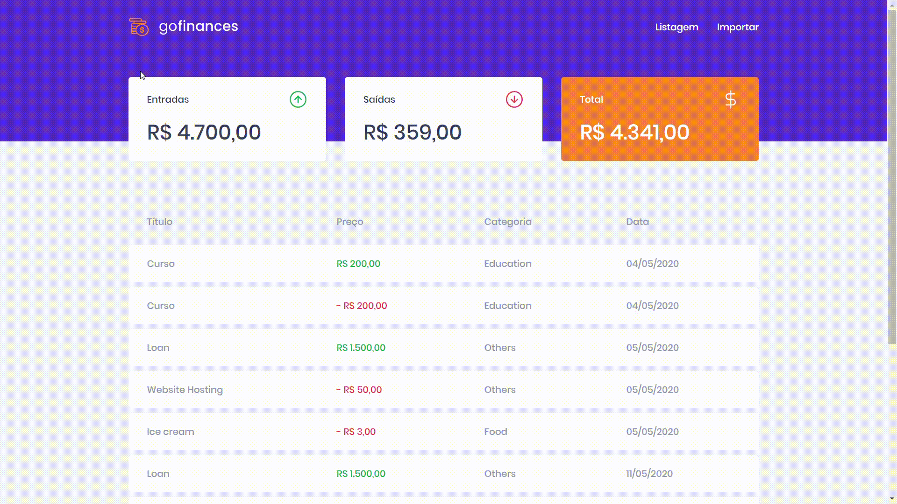

<h1 align="center">
  
</h1>

<h3>
  
</h3>

---

## 📝About

The **GoFinance** is the project we're developing during the Bootcamp

---

## 🚀The challenge

In this challenge, we learned more concepts from React, such as: date and currency formats and the coolest, how the dropzone tool works.

---

## 💻 Running project

```bash
$ git clone https://github.com/albino29/challenge-7-fundamentos-react
$ cd challenge-7-fundamentos-react
$ yarn
$ yarn start
```
